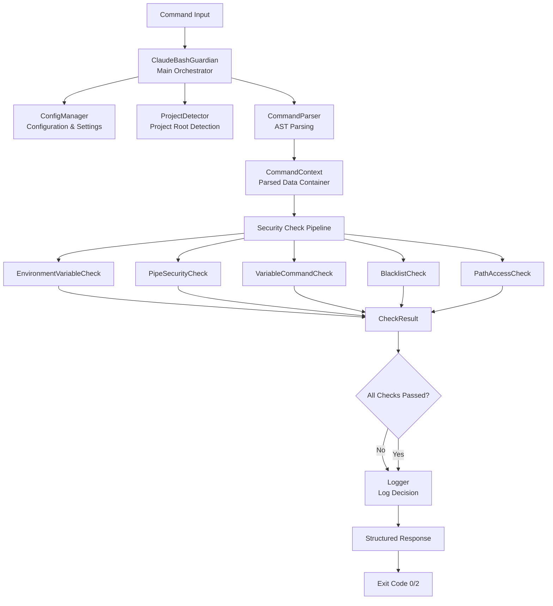
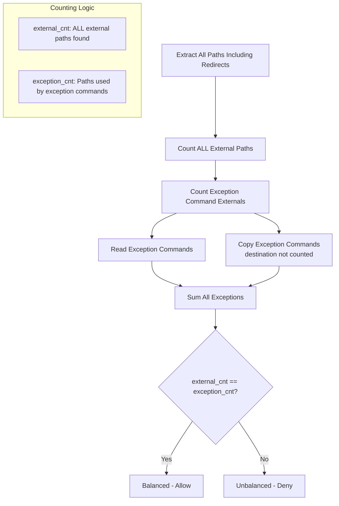
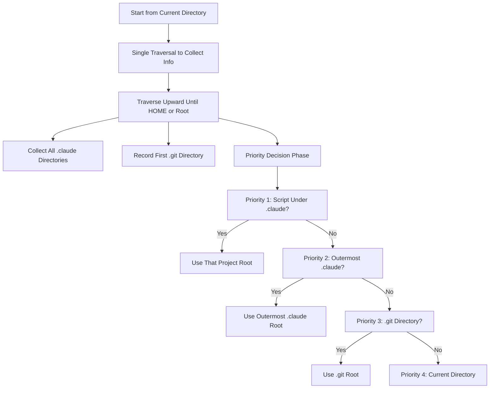

# Claude Code Bash Guardian

[](LICENSE)

A security hook for **Claude Code's PreToolUse Bash Tool**.  
Designed for **unattended agent runs** (non-interactive sessions), it ensures safer automated operations by providing:

- Robust bash command filtering  
- Advanced bypass prevention  
- Intelligent path access control  

**Hook Type:** PreToolUse (Bash Tool)  
**Operation Mode:** Fully automated, no user interaction  
**Target Users:** Developers using Claude Code (unattended / automated workflows)

## ⚠️ Security Disclaimer

**This tool provides defense-in-depth security for Claude Code bash operations, but is not infallible.**

While Claude Code Bash Guardian has been extensively tested against common attack patterns and bypass techniques, no security tool can guarantee 100% protection against all possible threats. Key considerations:

- **Residual Risk**: Despite comprehensive testing, false negatives (dangerous commands being allowed) remain theoretically possible due to the complexity of bash syntax and potential zero-day bypass techniques
- **Threat Model**: The primary threat actor is an AI agent making mistakes or being prompted inappropriately, not a deliberate attacker with system access
- **Risk-Benefit Analysis**: The security benefits of filtering automated agent commands significantly outweigh the residual risks in most development environments
- **Best Practices**:
  - **Always maintain current backups** of critical data and code
  - **Use version control** (git) to track and revert unwanted changes
  - **Run in isolated environments** when working with sensitive systems
  - **Review logs** periodically
  - **Test custom configurations** thoroughly before production use

This tool is provided "as is" under the MIT License, without warranty of any kind. Users assume all risks associated with its deployment and operation.

---

## 🛡️ Security Features

- **Enhanced Wrapper Command Detection**: Intelligently detects and scans wrapper commands (`timeout`, `xargs`, `sudo`, etc.)
- **Variable Command Prevention**: Blocks `$var`, `$(cmd)`, `` `cmd` `` as command names
- **Script Injection Protection**: Prevents `echo "rm -rf /" > script.sh && bash script.sh` attacks
- **Intelligent Path Normalization**: Smart path resolution and matching
- **Complex Structure Support**: Detects dangerous commands in `for` / `while` / `if` statements
- **Absolute Path Resolution**: Path traversal attacks (`../../etc/passwd`) are blocked
- **Comprehensive Blacklisting**: 15+ categories of dangerous command patterns with bypass prevention
- **Flexible sudo Configuration**: Configurable privilege escalation control

## Table of Contents

- [Usage Guide](#usage-guide)
  - [Prerequisites](#prerequisites)
  - [Deployment Methods](#deployment-methods)
  - [Configuration Format](#configuration-format)
  - [Project Directory Detection](#project-directory-detection)
- [Technical Reference](#technical-reference)
  - [System Architecture](#system-architecture)
  - [Key Implementation Details](#key-implementation-details)
  - [Extending the System](#extending-the-system)
- [Known Limitations](#known-limitations)

---

## Usage Guide

### Prerequisites

Install required Python dependencies (`PyYAML` and `bashlex`):

#### Using pip
```bash
pip3 install PyYAML bashlex
```

#### Using conda
```bash
conda install -c conda-forge pyyaml bashlex
```

#### Using poetry
```bash
poetry add PyYAML bashlex
```

### Deployment Methods

**Note**: Customize the configuration to match your specific security requirements and workflow. The default settings provide a balanced baseline, but you should adjust them based on your needs.

#### Global Deployment
Deploy the permission system across all Claude Code projects:

```bash
# 1. Copy files to global Claude directory
cp claude_code_bash_guardian.py ~/.claude/hooks/
cp claude_code_bash_guardian_config.yaml ~/.claude/hooks/
chmod +x ~/.claude/hooks/claude_code_bash_guardian.py

# 2. Configure global settings
# If you already have a ~/.claude/settings.json file, merge the following configuration:
# The hook should be added to the existing "hooks.PreToolUse" array.

# For new installation (no existing settings.json):
cat > ~/.claude/settings.json << 'EOF'
{
  "hooks": {
    "PreToolUse": [
      {
        "matcher": "Bash",
        "hooks": [
          {
            "type": "command",
            "command": "$HOME/.claude/hooks/claude_code_bash_guardian.py"
          }
        ]
      }
    ]
  }
}
EOF
```

#### Project-Specific Deployment
Deploy the permission system for a specific project:

```bash
# 1. Create project hooks directory
mkdir -p your_project/.claude/hooks/

# 2. Copy files to project directory
cp claude_code_bash_guardian.py your_project/.claude/hooks/
cp claude_code_bash_guardian_config.yaml your_project/.claude/hooks/
chmod +x your_project/.claude/hooks/claude_code_bash_guardian.py

# 3. Configure project settings
# If your project already has .claude/settings.json, merge the hook configuration.
# Otherwise, create a new settings.json with:
cat > your_project/.claude/settings.json << 'EOF'
{
  "hooks": {
    "PreToolUse": [
      {
        "matcher": "Bash",
        "hooks": [
          {
            "type": "command",
            "command": ".claude/hooks/claude_code_bash_guardian.py"
          }
        ]
      }
    ]
  }
}
EOF
```

### Configuration Format

The `claude_code_bash_guardian_config.yaml` file controls all security policies.

#### Basic Security Controls

```yaml
forbidden_env_vars:       # Block dangerous environment variables
  - LD_PRELOAD
  - PATH

forbidden_pipe_targets:   # Block dangerous pipe targets
  - sh
  - bash

multi_level_commands:     # Commands with subcommands
  - git
  - docker
```

#### Command Blacklist System

##### Wrapper Commands

```yaml
wrapper_commands:         # Commands that can execute other commands
  - sudo
  - timeout
  - xargs
  - env
  - nice
```

**⚠️ Important**: Wrapper commands use a scanning strategy that may produce false positives to ensure safety. For example, `xargs echo rm -rf` (which just prints text) will be blocked because it contains a dangerous pattern. This is intentional - the system prioritizes security over convenience.

##### Command Blacklist

```yaml
command_blacklist:
  # Simple commands
  - sudo              # Remove to allow sudo as wrapper only
  - rm
  
  # Commands with parameters
  - git reset --hard  # Exact match for long flags
  - rm -r             # Flexible match for short flags
  - git clean -fd     # AND logic: needs both -f and -d
  
  # Path-agnostic blocking
  - bash              # Blocks from any path (/bin/bash, ./bash, etc.)
  - sh
```

**Parameter Matching Rules:**
- **Long flags** (`--hard`): Exact match required
- **Short flags** (`-r`): Flexible combination (`-rf`, `-fr`, `-f -r` all match)
- **Multiple parameters** (`-fd`): AND logic - all must be present
- **Path-agnostic**: Commands like `bash` are blocked from any path

#### Security Options

```yaml
security_options:
  allow_external_path_access: false  # Restrict access outside project
  
  external_read_exception_commands:  # Can read from external paths
    - cd, ls, cat, grep, find, diff  # (see config for full list)
  
  external_copy_exception_commands:  # Can copy FROM external paths
    - cp, ln, rsync
  
  allow_variable_commands: false     # Block $var, $(cmd), `cmd` as commands
```

**Path Access Rules:**
- By default, commands can only access project directory and `/tmp`
- Exception commands can access external paths for reading or copying
- `/dev/*` special files are always allowed (null, stdout, stderr, etc.)
- Uses balance check: total external paths must equal exception command paths

**Variable Command Control:**
- When disabled: blocks variables as commands but allows as arguments
- When enabled: permits all variable usage (less secure)

#### Usage Examples

```bash
# Script injection - BLOCKED
echo "rm -rf /" > cmd.sh && bash cmd.sh

# Path traversal - BLOCKED  
cp file ../../etc/shadow

# Variable as command - BLOCKED
cmd="rm"; $cmd file

# Variable as argument - ALLOWED
echo $USER
```

#### System Configuration

```yaml
system_config:
  debug_mode: false
  log_denials: true     # Log blocked commands to logs/permission_denials.json
  log_approvals: false  # Log allowed commands to logs/permission_approvals.json
```

### Project Directory Detection

The system automatically determines your project root using this priority order:

1. **Script location**: If the hook is in `.claude/hooks/`, uses that project root
2. **Outermost .claude**: Uses the highest-level `.claude` directory found
3. **Git repository**: Falls back to `.git` repository root
4. **Current directory**: Uses current working directory if no markers found

**Boundaries**: Detection stops at home (`~`) or root (`/`) directory.

When `allow_external_path_access: true`, detection is skipped entirely.

---

## Technical Reference

This section provides detailed implementation information for developers who want to understand how the system works internally.

### System Architecture

The permission system uses a modular architecture with clear separation of concerns:



#### Component Responsibilities

**Core Components:**
- **ClaudeBashGuardian**: Main orchestrator that coordinates all components
- **ConfigManager**: Handles configuration loading, merging, and access
- **ProjectDetector**: Determines project root directory using priority-based detection
- **CommandParser**: Parses bash commands into AST and extracts structured data
- **Logger**: Manages security decision logging

**Data Models:**
- **CommandContext**: Container for parsed command data (AST, paths, arguments)
- **CheckResult**: Standardized result object for security checks

**Security Checks (all extend SecurityCheck base class):**
- **EnvironmentVariableCheck**: Validates environment variable usage
- **PipeSecurityCheck**: Checks for dangerous pipe targets
- **VariableCommandCheck**: Prevents variable command execution
- **BlacklistCheck**: Matches against command blacklist patterns
- **PathAccessCheck**: Controls external path access

### Design Principles

1. **Single Responsibility**: Each class has one clear purpose
2. **Dependency Injection**: Components receive dependencies through constructors
3. **Open/Closed**: New security checks can be added without modifying existing code
4. **Composition over Inheritance**: Components are composed rather than deeply inherited
5. **Fail-Safe Defaults**: Security decisions default to deny when uncertain

### Key Implementation Details

#### AST-Based Security Checking

The system uses bashlex to parse bash commands into Abstract Syntax Trees (AST) for all security checks. This AST-based approach provides several advantages over regex-based parsing:

1. **Context Awareness**: Understands shell quoting, escaping, and command structure
2. **Normalization**: Bashlex automatically normalizes obfuscated patterns (e.g., `ba'sh'` → `bash`)
3. **Accurate Detection**: Distinguishes between actual commands and strings (e.g., `echo 'rm -rf /'` is safe)

For compound commands like `ls /tmp/ && cp /etc/passwd ./local && touch ~/file`, bashlex generates a nested tree structure containing:
- **ListNode**: The top-level container for compound commands
- **CommandNode**: Individual command representations
- **WordNode**: Command arguments and parameters
- **OperatorNode**: Logical operators like `&&`, `||`, `;`
- **PipelineNode**: Pipe operations between commands
- **AssignmentNode**: Environment variable assignments

The security checks traverse this AST to identify:
- **Pipe targets**: Detected from PipelineNode structures, not string patterns
- **Environment variables**: Found in AssignmentNode and command arguments
- **Variable commands**: Identified by ParameterNode and CommandsubstitutionNode in command position

The **CommandParser** class performs single-pass data extraction from the AST, creating a **CommandContext** object containing:
- **individual_commands**: List of isolated commands (e.g., `["ls /tmp/", "cp /etc/passwd ./local", "touch ~/file"]`)
- **all_paths**: All file paths found in the command (e.g., `["/tmp/", "/etc/passwd", "./local", "~/file"]`)
- **all_arguments**: Flattened list of all command parts for comprehensive analysis
- **ast_tree**: The original AST for security checks to traverse
- **project_root**: The detected project root directory for path resolution

#### Blacklist Pattern Matching

The **BlacklistCheck** class employs two distinct strategies based on wrapper command detection:

**Strategy 1: Direct Matching** (No wrapper detected)
- Applied when the first command is not a wrapper
- Direct pattern matching at position 0
- Standard command and argument verification

**Strategy 2: Scanning Strategy** (Wrapper detected)
- Triggered for commands like `timeout`, `xargs`, `env`
- Three-phase checking:
  1. **Wrapper check**: Verify if wrapper itself is blacklisted
  2. **Single command scan**: For patterns like "sudo", scan all arguments
  3. **Multi-part scan**: For patterns like "rm -r", find command then verify arguments

**Parameter Matching Implementation:**
- **Long flags** (`--hard`): String exact match in arguments list
- **Short flags** (`-r`): Character-level matching, handles combinations like `-rf`, `-fr`, `-f -r`
- **Multiple parameters** (`-fd`): AND logic ensures all required flags are present
- **Path normalization**: Commands are matched by basename for system paths, relative path for project paths

**Example Matching Flow:**
```
Command: timeout 5 rm -rf /tmp/test
1. Detect 'timeout' as wrapper
2. Scan arguments for 'rm'
3. Find 'rm' at position 2
4. Check if '-r' flag present (found in '-rf')
5. Block command
```

This scanning approach deliberately produces false positives (e.g., `xargs echo rm -rf` is blocked even though it just prints text) to ensure dangerous patterns never execute.

#### Path Access Control Algorithm

The **PathAccessCheck** class uses a unified counting-based balance check for all external path access:



**Implementation Details:**

- **External Path Detection**: Paths outside project root and /tmp are considered external
- **Read Exception Commands**: All non-flag arguments count as potential external paths
- **Copy Exception Commands**: Only source paths (all except last argument) count
- **Special Files**: `/dev/null`, `/dev/stdout`, `/dev/stderr`, etc. are never counted as external
- **Redirects**: Output redirects are automatically detected and counted
- **Balance Rule**: Total external paths MUST equal exception command paths

**Example Balance Calculation:**
```
Command: cat /etc/passwd > /external/output
- External paths found: 2 (/etc/passwd, /external/output)
- Read exception paths: 1 (cat can read /etc/passwd)
- Balance: 2 ≠ 1 → DENIED
```

#### Variable Command Detection

The **VariableCommandCheck** prevents dynamic command execution:

- **Variable expansion**: `$cmd`, `${cmd}`
- **Command substitution**: `$(command)`, `` `command` ``
- **Special commands**: `eval`, `source`, `.` with variables

**Detection occurs at AST level:**
- ParameterNode or CommandsubstitutionNode in command position → blocked
- Same nodes in argument position → allowed

This enables smart detection that blocks `$cmd server` but allows `echo $USER`.

### Project Root Detection Algorithm

The system uses a sophisticated 4-priority algorithm to determine the project root:



**Priority Levels Explained:**

1. **Script Under .claude Directory**: When the hook script itself is located under a `.claude/hooks/` directory, use that project as root. This ensures project-specific deployments work correctly.

2. **Outermost .claude Directory**: If `.claude` directories are found during traversal but the script isn't in any of them, use the outermost (highest-level) one. This handles nested project structures.

3. **Git Repository Root**: If no `.claude` directories exist, fall back to the `.git` repository root. This provides sensible defaults for most development projects.

4. **Current Directory**: If no project markers are found, conservatively use the current working directory to avoid accidentally granting broad access.

**Traversal Boundaries:**
- **HOME Boundary**: Stops at `~/` directory, doesn't check `~/.claude`
- **Root Boundary**: Stops at `/` directory, doesn't check `/.claude`  
- **Performance Optimization**: When `allow_external_path_access: true`, the entire detection is skipped

### Extending the System

To add a new security check:

1. **Create a new class** extending `SecurityCheck`:
```python
class MyCustomCheck(SecurityCheck):
    def check(self, context: CommandContext) -> CheckResult:
        # Implement your security logic
        if self.is_dangerous(context):
            return CheckResult.deny("Custom check failed")
        return CheckResult.allow()
```

2. **Add to the check pipeline** in `ClaudeBashGuardian.__init__()`:
```python
self.checks = [
    EnvironmentVariableCheck(self.config),
    # ... existing checks ...
    MyCustomCheck(self.config)  # Add your check
]
```

3. **Configure in YAML** if needed:
```yaml
my_custom_settings:
  forbidden_patterns: [...]
```

## Known Limitations

Despite the AST-based improvements, certain patterns still cannot be fully analyzed:

1. **Loop body commands**: `for i in $(ls /etc); do rm $i; done` - Commands inside loop structures aren't fully detected
2. **Find -exec parameters**: `find /etc -exec rm {} \;` - The -exec parameter isn't analyzed
3. **Complex constructs not fully analyzed**:
     - `echo "import os; os.system('rm -rf /')" | python3` - Interpreter not in forbidden list
     - `cat script | dash` - Alternative shell not in forbidden list  
     - `echo "test" | awk 'system("ls /etc")'` - awk can execute system commands
     - `cat file | tee >(bash)` - Process substitution syntax not fully parsed by bashlex

---

## License

This project is licensed under the MIT License - see the [LICENSE](LICENSE) file for details.

---

## Development

This project was developed with assistance from Claude AI (Anthropic) for implementation, testing, and documentation. Human guidance was provided for requirements specification, security design decisions, and validation.

